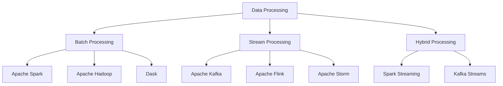
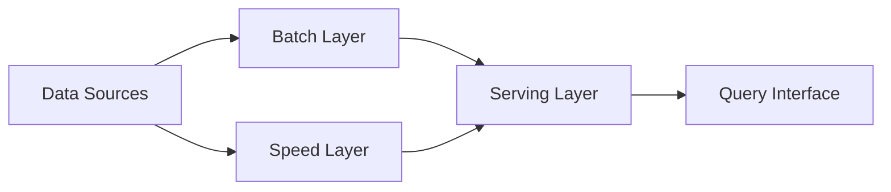
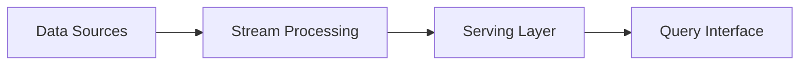
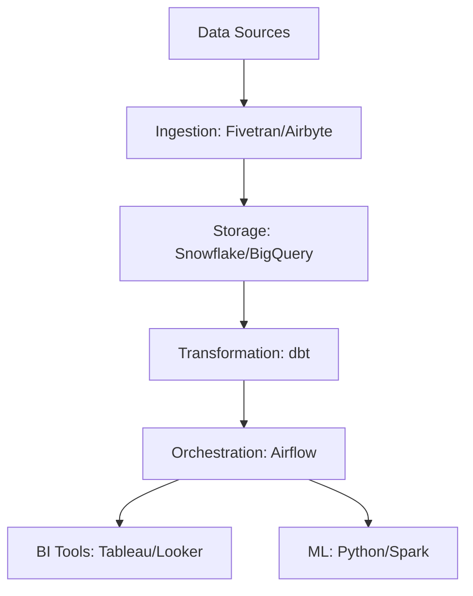

# Data Engineering Complete Guide

## Table of Contents
1. [Introduction to Data Engineering](#introduction-to-data-engineering)
2. [Core Concepts](#core-concepts)
3. [Essential Skills](#essential-skills)
4. [Tools & Technologies](#tools--technologies)
5. [Data Pipeline Architecture](#data-pipeline-architecture)
6. [Best Practices](#best-practices)
7. [Learning Path](#learning-path)
8. [Career Roadmap](#career-roadmap)

---

## Introduction to Data Engineering

### What is Data Engineering?

Data Engineering is the practice of designing, building, and maintaining systems that collect, store, process, and analyze data at scale. Data Engineers create the infrastructure and architecture that enables data scientists, analysts, and business users to work with data effectively.

### Role of a Data Engineer

A Data Engineer is responsible for:
- **Building data pipelines** to move and transform data from various sources
- **Designing data architectures** that are scalable, reliable, and efficient
- **Ensuring data quality** and consistency across systems
- **Optimizing data storage** and retrieval mechanisms
- **Maintaining data infrastructure** and monitoring performance
- **Enabling analytics** by making data accessible to stakeholders

### Data Engineer vs. Other Data Roles

| Role | Primary Focus | Key Skills |
|------|--------------|------------|
| **Data Engineer** | Building data infrastructure & pipelines | Programming, databases, distributed systems |
| **Data Scientist** | Extracting insights & building ML models | Statistics, machine learning, domain expertise |
| **Data Analyst** | Analyzing data & creating reports | SQL, visualization, business intelligence |
| **ML Engineer** | Deploying & scaling ML models | ML frameworks, software engineering, DevOps |

---

## Core Concepts

### 1. Data Pipeline

A **data pipeline** is a series of processes that move data from source systems to destination systems, often transforming it along the way.

**Stages of a Data Pipeline:**
```
Source → Ingestion → Storage → Processing → Transformation → Storage → Consumption
```

**Types of Data Pipelines:**
- **Batch Processing**: Processing large volumes of data at scheduled intervals
- **Stream Processing**: Processing data in real-time as it arrives
- **Hybrid**: Combination of batch and streaming

### 2. ETL vs. ELT

**ETL (Extract, Transform, Load):**
- Extract data from sources
- Transform data before loading (traditional approach)
- Load into data warehouse
- Best for: Structured data, complex transformations

**ELT (Extract, Load, Transform):**
- Extract data from sources
- Load raw data into storage first
- Transform data after loading (modern approach)
- Best for: Big data, cloud data warehouses

### 3. Data Storage Concepts

**Data Warehouse:**
- Centralized repository for structured, processed data
- Optimized for analytics and reporting
- Examples: Snowflake, BigQuery, Redshift

**Data Lake:**
- Storage repository for raw, unstructured, and structured data
- Stores data in native format
- Examples: AWS S3, Azure Data Lake, HDFS

**Data Lakehouse:**
- Combines benefits of data lakes and warehouses
- Supports both analytics and ML workloads
- Examples: Databricks, Delta Lake

### 4. Data Modeling

**Dimensional Modeling:**
- **Fact Tables**: Store measurable events (sales, clicks)
- **Dimension Tables**: Store descriptive attributes (customer, product)
- **Star Schema**: Central fact table with dimension tables
- **Snowflake Schema**: Normalized dimension tables

**Data Vault:**
- Designed for long-term historical storage
- Highly scalable and flexible
- Components: Hubs, Links, Satellites

### 5. Data Quality

**Six Dimensions of Data Quality:**
1. **Accuracy**: Data correctly represents reality
2. **Completeness**: All required data is present
3. **Consistency**: Data is uniform across systems
4. **Timeliness**: Data is up-to-date
5. **Validity**: Data conforms to defined formats
6. **Uniqueness**: No duplicate records

### 6. Distributed Computing

**Key Concepts:**
- **Horizontal Scaling**: Adding more machines
- **Vertical Scaling**: Adding more resources to existing machines
- **Partitioning**: Dividing data across multiple nodes
- **Replication**: Copying data for redundancy
- **CAP Theorem**: Consistency, Availability, Partition tolerance

---

## Essential Skills

### 1. Programming Languages

**Python** ⭐ (Most Important)
- Data manipulation: pandas, NumPy
- Data processing: PySpark, Dask
- Workflow orchestration: Airflow, Prefect
- APIs and web scraping: requests, BeautifulSoup

**SQL** ⭐ (Critical)
- Query optimization
- Window functions
- CTEs (Common Table Expressions)
- Stored procedures and functions
- Performance tuning

**Scala/Java**
- Used with Apache Spark
- JVM-based big data tools

**Bash/Shell Scripting**
- Automation and system administration
- Cron jobs and scheduling

### 2. Database Technologies

**Relational Databases (SQL):**
- PostgreSQL
- MySQL
- Oracle
- SQL Server

**NoSQL Databases:**
- **Document**: MongoDB, Couchbase
- **Key-Value**: Redis, DynamoDB
- **Column-Family**: Cassandra, HBase
- **Graph**: Neo4j, Amazon Neptune

**Cloud Data Warehouses:**
- Snowflake
- Google BigQuery
- Amazon Redshift
- Azure Synapse Analytics

### 3. Big Data Technologies

**Apache Spark** ⭐
- Distributed data processing framework
- Supports batch and streaming
- APIs: PySpark, Spark SQL, Spark Streaming

**Apache Hadoop**
- Distributed storage (HDFS)
- MapReduce processing
- YARN resource management

**Apache Kafka** ⭐
- Distributed streaming platform
- Real-time data pipelines
- Event-driven architectures

**Apache Flink**
- Stream processing framework
- Low-latency processing

### 4. Cloud Platforms

**Amazon Web Services (AWS):**
- S3: Object storage
- Redshift: Data warehouse
- EMR: Managed Hadoop/Spark
- Glue: ETL service
- Kinesis: Streaming data
- Lambda: Serverless computing

**Google Cloud Platform (GCP):**
- BigQuery: Data warehouse
- Cloud Storage: Object storage
- Dataflow: Stream/batch processing
- Pub/Sub: Messaging service
- Dataproc: Managed Spark/Hadoop

**Microsoft Azure:**
- Azure Data Lake
- Azure Synapse Analytics
- Azure Data Factory
- Azure Databricks

### 5. Workflow Orchestration

**Apache Airflow** ⭐
- Define workflows as DAGs (Directed Acyclic Graphs)
- Schedule and monitor pipelines
- Rich UI and extensibility

**Prefect**
- Modern workflow orchestration
- Dynamic workflows
- Better error handling

**Dagster**
- Data-aware orchestration
- Testing and development tools

**Luigi**
- Python-based workflow management
- Dependency resolution

### 6. Data Integration & ETL Tools

**Modern ETL Tools:**
- dbt (data build tool): SQL-based transformations
- Fivetran: Automated data integration
- Airbyte: Open-source data integration
- Stitch: Cloud ETL service

**Traditional ETL:**
- Informatica
- Talend
- SSIS (SQL Server Integration Services)

### 7. Version Control & CI/CD

**Git** ⭐
- Version control for code
- Collaboration and branching strategies
- GitHub, GitLab, Bitbucket

**CI/CD:**
- Jenkins
- GitHub Actions
- GitLab CI
- CircleCI

### 8. Containerization & Orchestration

**Docker** ⭐
- Containerize applications
- Consistent environments
- Portable deployments

**Kubernetes**
- Container orchestration
- Scaling and management
- Cloud-native deployments

### 9. Data Formats & Serialization

**File Formats:**
- **CSV**: Simple, human-readable
- **JSON**: Nested data structures
- **Parquet**: Columnar, compressed, efficient
- **Avro**: Row-based, schema evolution
- **ORC**: Optimized for Hive

**Compression:**
- Gzip, Snappy, LZO, Bzip2

### 10. Monitoring & Logging

**Tools:**
- Prometheus: Metrics collection
- Grafana: Visualization
- ELK Stack: Elasticsearch, Logstash, Kibana
- DataDog: Cloud monitoring
- CloudWatch: AWS monitoring

---

## Tools & Technologies

### Data Processing Frameworks



### Technology Stack by Use Case

**Real-time Analytics:**
- Kafka + Flink + Elasticsearch + Kibana

**Batch Processing:**
- Airflow + Spark + S3 + Redshift

**Data Warehouse:**
- Fivetran + Snowflake + dbt + Looker

**Machine Learning Pipeline:**
- Airflow + Spark + MLflow + S3 + SageMaker

---

## Data Pipeline Architecture

### Lambda Architecture



**Components:**
- **Batch Layer**: Historical data processing
- **Speed Layer**: Real-time processing
- **Serving Layer**: Combines batch and real-time views

### Kappa Architecture



**Simplification:**
- Everything is a stream
- Single processing layer
- Easier to maintain

### Modern Data Stack



---

## Best Practices

### 1. Design Principles

**Idempotency:**
- Running the same operation multiple times produces the same result
- Critical for retry logic and failure recovery

**Incremental Processing:**
- Process only new or changed data
- Reduces processing time and costs

**Schema Evolution:**
- Design systems to handle schema changes
- Use backward/forward compatible formats

**Data Partitioning:**
- Partition by date, region, or other logical divisions
- Improves query performance

### 2. Code Quality

**Version Control:**
- All code in Git repositories
- Meaningful commit messages
- Code reviews and pull requests

**Testing:**
- Unit tests for transformations
- Integration tests for pipelines
- Data quality tests

**Documentation:**
- README files for projects
- Inline code comments
- Data dictionaries
- Architecture diagrams

### 3. Performance Optimization

**Query Optimization:**
- Use appropriate indexes
- Avoid SELECT *
- Optimize JOIN operations
- Use partitioning and clustering

**Spark Optimization:**
- Broadcast small tables
- Avoid shuffles when possible
- Use appropriate partition sizes
- Cache intermediate results

**Storage Optimization:**
- Use columnar formats (Parquet, ORC)
- Apply compression
- Partition large datasets

### 4. Security & Compliance

**Data Security:**
- Encryption at rest and in transit
- Access control and authentication
- Audit logging

**Compliance:**
- GDPR, CCPA, HIPAA compliance
- Data retention policies
- PII (Personally Identifiable Information) handling

### 5. Monitoring & Alerting

**What to Monitor:**
- Pipeline execution status
- Data quality metrics
- System resource usage
- Processing latency
- Error rates

**Alerting:**
- Set up alerts for failures
- Define SLAs (Service Level Agreements)
- On-call rotations

---

## Learning Path

### Phase 1: Foundations (1-2 months)

**Week 1-2: SQL Mastery**
- [ ] Learn basic SQL queries
- [ ] Practice JOINs, aggregations, subqueries
- [ ] Master window functions
- [ ] Study query optimization
- **Resources**: Mode Analytics SQL Tutorial, LeetCode SQL problems

**Week 3-4: Python Fundamentals**
- [ ] Python basics (data types, control flow, functions)
- [ ] pandas for data manipulation
- [ ] NumPy for numerical operations
- [ ] File I/O and APIs
- **Resources**: Python.org tutorial, Real Python

**Week 5-6: Linux & Command Line**
- [ ] Basic Linux commands
- [ ] Bash scripting
- [ ] Cron jobs
- [ ] SSH and remote servers
- **Resources**: Linux Journey, The Linux Command Line book

**Week 7-8: Git & Version Control**
- [ ] Git basics (clone, commit, push, pull)
- [ ] Branching and merging
- [ ] Pull requests and code reviews
- **Resources**: Git documentation, GitHub Learning Lab

### Phase 2: Core Data Engineering (2-3 months)

**Month 1: Databases**
- [ ] Relational database design
- [ ] PostgreSQL administration
- [ ] NoSQL databases (MongoDB, Redis)
- [ ] Database performance tuning
- **Project**: Build a normalized database schema for an e-commerce system

**Month 2: Big Data Technologies**
- [ ] Apache Spark fundamentals
- [ ] PySpark programming
- [ ] Spark SQL and DataFrames
- [ ] Spark optimization techniques
- **Project**: Process large CSV files with PySpark

**Month 3: Data Warehousing**
- [ ] Data warehouse concepts
- [ ] Dimensional modeling
- [ ] Cloud data warehouses (Snowflake or BigQuery)
- [ ] ETL vs. ELT
- **Project**: Build a star schema data warehouse

### Phase 3: Advanced Topics (2-3 months)

**Month 1: Workflow Orchestration**
- [ ] Apache Airflow architecture
- [ ] Writing DAGs
- [ ] Operators and sensors
- [ ] Monitoring and debugging
- **Project**: Create an end-to-end data pipeline with Airflow

**Month 2: Streaming Data**
- [ ] Apache Kafka fundamentals
- [ ] Producers and consumers
- [ ] Stream processing with Spark Streaming
- [ ] Real-time analytics
- **Project**: Build a real-time data pipeline

**Month 3: Cloud Platforms**
- [ ] AWS/GCP/Azure fundamentals
- [ ] Cloud storage (S3, GCS)
- [ ] Cloud data services
- [ ] Infrastructure as Code (Terraform)
- **Project**: Deploy a data pipeline on cloud

### Phase 4: Specialization & Production (Ongoing)

**Advanced Topics:**
- [ ] Data quality frameworks (Great Expectations)
- [ ] dbt for transformations
- [ ] Docker and Kubernetes
- [ ] CI/CD for data pipelines
- [ ] Data governance and security
- [ ] Machine learning pipelines

**Real-World Projects:**
1. **E-commerce Analytics Pipeline**: Ingest, process, and analyze user behavior data
2. **Real-time Dashboard**: Stream processing for live metrics
3. **Data Lake Implementation**: Build a scalable data lake architecture
4. **ML Feature Store**: Create features for machine learning models

---

## Career Roadmap

### Entry Level: Junior Data Engineer (0-2 years)

**Responsibilities:**
- Write and maintain ETL scripts
- Assist in pipeline development
- Monitor data quality
- Debug simple issues

**Skills to Focus On:**
- SQL proficiency
- Python programming
- Basic cloud knowledge
- Git version control

**Typical Salary Range:** $60,000 - $90,000

### Mid Level: Data Engineer (2-5 years)

**Responsibilities:**
- Design and build data pipelines
- Optimize existing systems
- Implement data quality checks
- Collaborate with data scientists and analysts

**Skills to Focus On:**
- Advanced Spark and distributed computing
- Cloud platform expertise
- Workflow orchestration (Airflow)
- System design

**Typical Salary Range:** $90,000 - $140,000

### Senior Level: Senior Data Engineer (5-8 years)

**Responsibilities:**
- Architect data platforms
- Lead technical projects
- Mentor junior engineers
- Define best practices and standards

**Skills to Focus On:**
- System architecture
- Performance optimization
- Leadership and mentoring
- Cross-functional collaboration

**Typical Salary Range:** $140,000 - $200,000

### Expert Level: Staff/Principal Data Engineer (8+ years)

**Responsibilities:**
- Define company-wide data strategy
- Solve complex technical challenges
- Drive innovation and technology adoption
- Influence product and business decisions

**Skills to Focus On:**
- Strategic thinking
- Technical leadership
- Innovation and research
- Business acumen

**Typical Salary Range:** $200,000 - $300,000+

### Alternative Paths:

**Data Architect:**
- Focus on designing data systems and architectures
- High-level strategic planning

**ML Engineer:**
- Specialize in machine learning infrastructure
- Deploy and scale ML models

**Engineering Manager:**
- Lead data engineering teams
- Balance technical and people management

---

## Recommended Resources

### Books

1. **"Designing Data-Intensive Applications"** by Martin Kleppmann
   - Deep dive into distributed systems and data architecture

2. **"The Data Warehouse Toolkit"** by Ralph Kimball
   - Dimensional modeling and data warehousing

3. **"Spark: The Definitive Guide"** by Bill Chambers & Matei Zaharia
   - Comprehensive guide to Apache Spark

4. **"Fundamentals of Data Engineering"** by Joe Reis & Matt Housley
   - Modern data engineering practices

### Online Courses

1. **DataCamp**: Data Engineering track
2. **Coursera**: Google Cloud Data Engineering Professional Certificate
3. **Udacity**: Data Engineering Nanodegree
4. **A Cloud Guru**: AWS/Azure/GCP data services
5. **LinkedIn Learning**: Apache Spark, Airflow courses

### Practice Platforms

1. **LeetCode**: SQL and algorithm problems
2. **HackerRank**: SQL and Python challenges
3. **Kaggle**: Real-world datasets
4. **Mode Analytics**: SQL tutorials
5. **DataLemur**: Data engineering interview prep

### Communities

1. **Reddit**: r/dataengineering
2. **Stack Overflow**: Data engineering tags
3. **LinkedIn Groups**: Data Engineering professionals
4. **Slack Communities**: dbt, Airflow, Spark communities
5. **Meetup**: Local data engineering groups

### Blogs & Newsletters

1. **Data Engineering Weekly**
2. **Locally Optimistic**
3. **Martin Kleppmann's Blog**
4. **Netflix Tech Blog**
5. **Uber Engineering Blog**

---

## Interview Preparation

### Technical Topics to Master

**SQL:**
- Complex JOINs and subqueries
- Window functions (ROW_NUMBER, RANK, LAG, LEAD)
- CTEs and recursive queries
- Query optimization and execution plans

**Python:**
- Data structures (lists, dicts, sets)
- List comprehensions
- Decorators and generators
- Object-oriented programming

**System Design:**
- Design a data pipeline
- Design a data warehouse
- Design a real-time analytics system
- Scalability and fault tolerance

**Coding:**
- String manipulation
- Array/list operations
- Hash tables
- Recursion

### Common Interview Questions

**Conceptual:**
1. What is the difference between ETL and ELT?
2. Explain ACID properties
3. What is data partitioning and why is it important?
4. How do you ensure data quality?
5. Explain CAP theorem

**Technical:**
1. Write a SQL query to find the second highest salary
2. How would you optimize a slow-running Spark job?
3. Design a data pipeline for processing clickstream data
4. How do you handle late-arriving data in streaming?
5. Explain how you would migrate a database with zero downtime

**Behavioral:**
1. Describe a challenging data engineering project
2. How do you handle conflicting priorities?
3. Tell me about a time you optimized a system
4. How do you stay updated with new technologies?

---

## Conclusion

Data Engineering is a rapidly evolving field that sits at the intersection of software engineering, distributed systems, and data science. Success in this role requires:

✅ **Strong technical foundation** in programming, databases, and distributed systems
✅ **Continuous learning** to keep up with new tools and technologies
✅ **Problem-solving mindset** to tackle complex data challenges
✅ **Collaboration skills** to work with diverse teams
✅ **Attention to detail** for data quality and reliability

### Next Steps

1. **Start with fundamentals**: Master SQL and Python
2. **Build projects**: Apply your knowledge to real-world problems
3. **Learn incrementally**: Don't try to learn everything at once
4. **Join communities**: Network with other data engineers
5. **Stay curious**: Explore new tools and technologies
6. **Practice regularly**: Consistency is key to mastery

Remember, becoming a proficient data engineer is a journey, not a destination. Focus on building a strong foundation, then gradually expand your expertise into specialized areas that interest you.

**Good luck on your Data Engineering journey! 🚀**

---

*Last Updated: January 2026*
